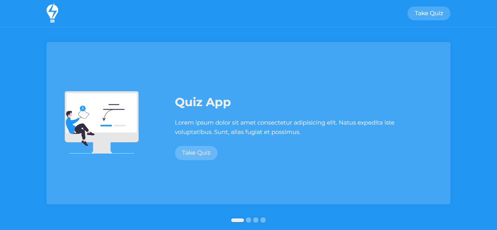
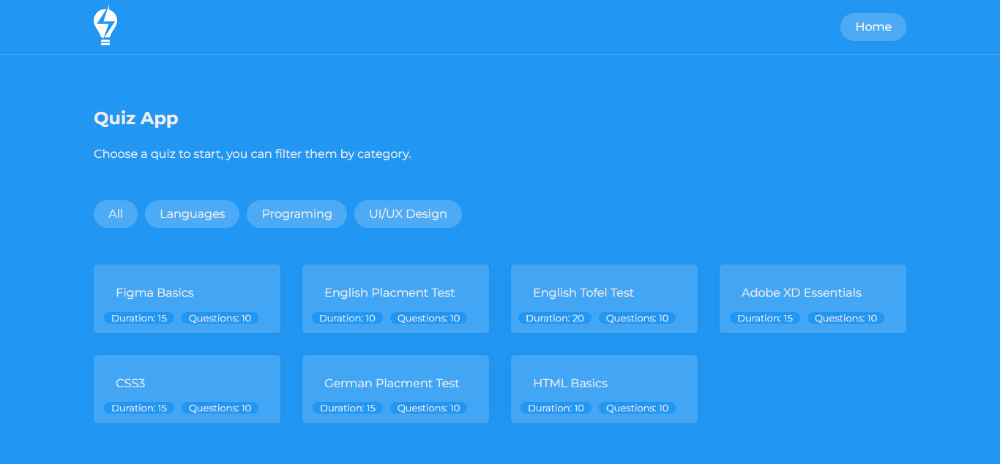
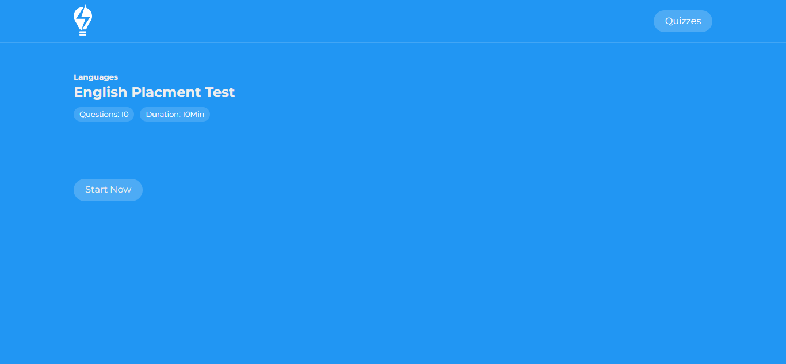
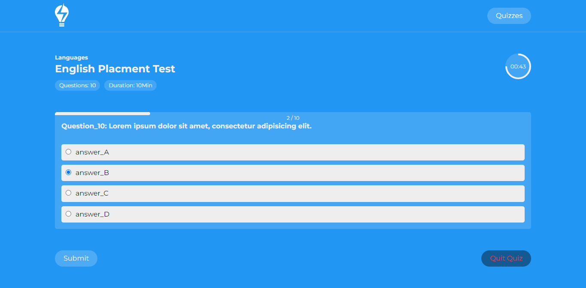
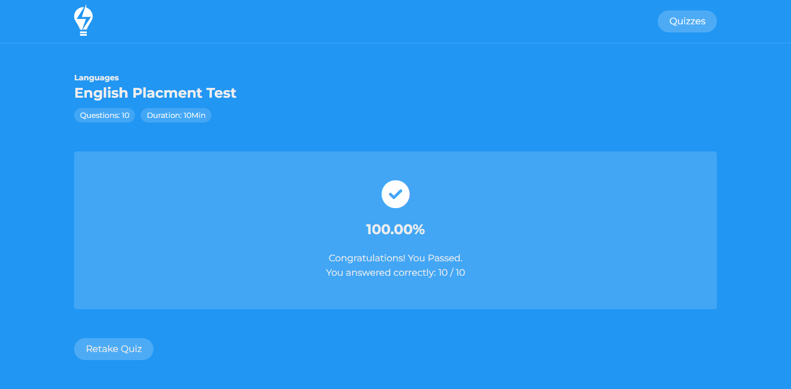

# IT Solutions Company Template
This repository is a Quiz application developed using HTML, CSS, and vanilla JavaScript.

All quizzes in demo preview contain dummy questions for the purpose of testing the application and their answers from 1 to 4,5.. are from A to D,A.. in order and so on.

## Live Previwe
[Github Pages](https://alialhussein.ml/quiz-app)

## Credits
* Free Google font [Montserrat](https://fonts.google.com/specimen/Montserrat)
* Images are from [unDraw](https://undraw.co/illustrations)

